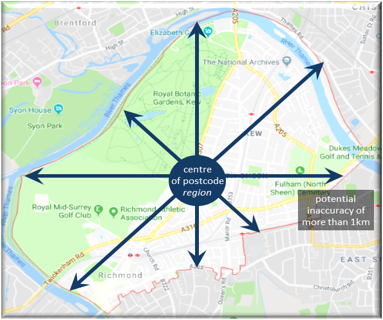
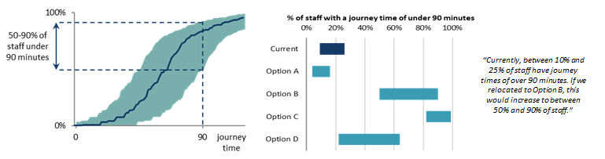

## The situation

Alternative government office locations were being considered and their impact on staff travel times.

## The analytical approach

Google maps API was used to estimate journey times from each home address to each potential location.

## Asking the right questions

* 90 minutes was considered to be a 'reasonable' travel time.
* The distribution of journey times was an output of interest, but the key focus was "What proportion of staff will have a journey time of over 90 minutes?"

## Defining and identifying uncertainty

Missing Data:

* Only first half of staff postcodes were available.
* Not known who could feasibly travel by car.

Assumptions:

* Staff begin and end work at 9am and 5pm.
* Journey time assumes all transport is running to schedule.
* Assumptions for transfer times, walking speeds etc.

## Understanding and measuring uncertainty

* Through sensitivity analysis on each parameter, the use of partial postcodes was found to be the most significant source of uncertainty and so dominant uncertainty was chosen.
* A Monte Carlo approach would have been a more complete analysis but was not viable in the available time.
* A sample of postcode districts were reviewed to calculate:- The journey time from the centre of the postcode; - The shortest possible journey from within that postcode; - The longest possible journey from within that postcode.
* The differences in these times were analysed across the sample to form distributions.
* Producing an uncertainty estimate of 90% of journey times to be within +/- 25 minutes of the calculated durations.

## Presenting and communicating uncertainty analysis

* A cumulative distribution of journey times along with uncertainty bounds clearly presented how many journey times were estimated to be within the crucial threshold of 90 minutes.
* Bar graph ranges were presented to the senior move managers, to show how journey times compared between location - the central estimate wasn't plotted to avoid the reader putting too much significance on it.
* Prose sentences were used to clearly present the key results.
* Unquantified uncertainties were communicated e.g. the assumption of no delays.
* The communication of the uncertainty made clear the case for obtaining exact postcodes, allowing the analysis to be repeated with less postcode uncertainty.

