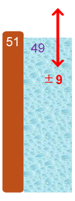
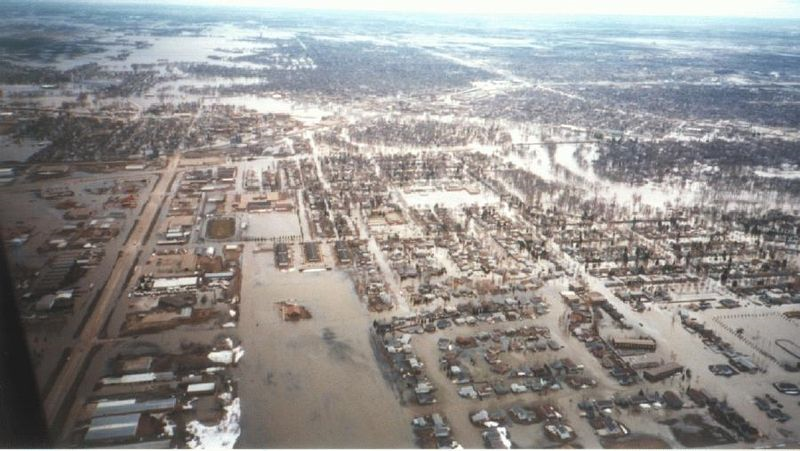

## Is this toolkit for you?

This toolkit is aimed at all analysts, whether you are new to the Government or an experienced analyst looking to develop the way you communicate uncertainty to stakeholders.

This document sits alongside the Aqua Book guidance on quality analysis. The Aqua Book should be read first as it describes the principles of uncertainty analysis and the processes that should be used in considering it. This is a supplementary document providing additional information for identifying, estimating and communicating uncertainty in analysis to support decisions and decision-makers.

## Uncertainty analysis: understanding what you don’t know

Uncertainty is unavoidable when making predictions about future events or impacts of decisions. Our knowledge of the present is typically incomplete; and we can’t be sure what will happen in the future. We can reduce uncertainty due to lack of knowledge by obtaining more information, or asking experts for advice. However, we can’t eliminate uncertainty entirely, so we must find ways to describe and communicate it.

There is a difference between uncertainty and risk; risk typically refers to the likelihood of a future unplanned event or unintended consequence that can be assigned a numeric probability. Forecasts of risk, like other forecasts, are themselves subject to uncertainty. For example, UK Met Office predictions of the risk of rain are uncertain as to whether it will rain at all, as well as uncertainty about how much it will rain. This uncertainty is described using a range from running several forecasts from equally likely initial conditions.

## Why does it matter?

Taking account of uncertainty – and being seen to do so – is important for public trust. We must not pretend that the consequences of a policy or decision are certain: they are always uncertain to some degree. For each option, a range of outcomes are possible. Implying certainty about one particular outcome can damage public trust when things turn out differently.

### Example: Red River Flood, Grand Forks USA, 1997

The National Weather Service (NWS) predicted, 2 months in advance, the Red River to crest 49 feet.

In response, the levees were built to handle a flood of 51 feet

The actual flood level was 54 feet.

Had the NWS communicated their uncertainty (+/- 9 feet) the several $billion damages as well as the huge personal impact could have been avoided.

